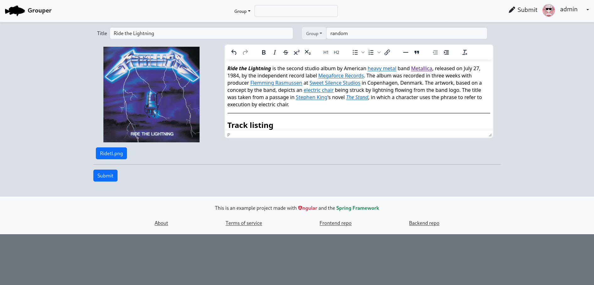
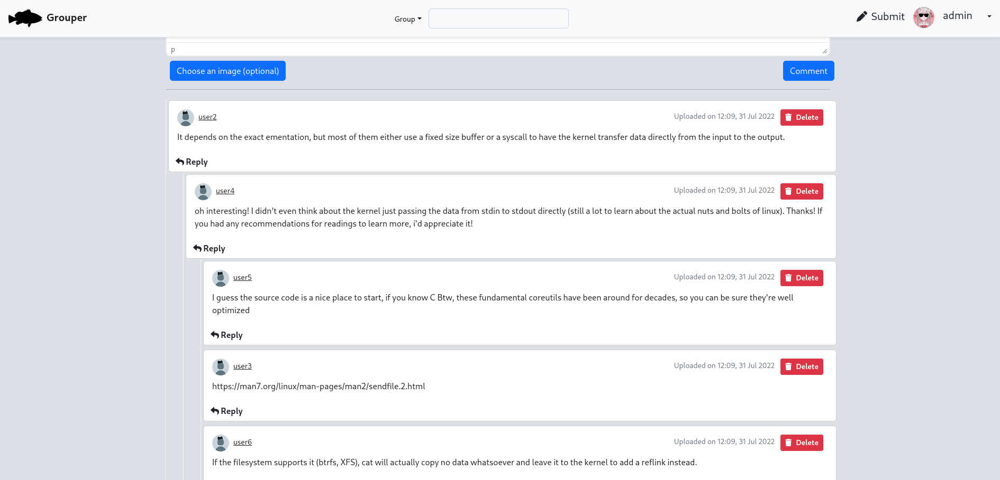
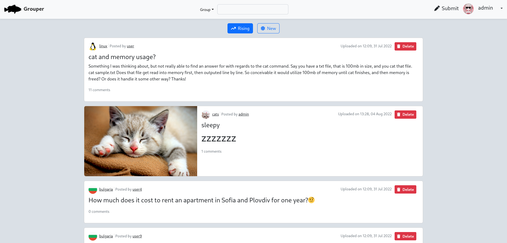

# Grouper Frontend
An Angular frontend for Grouper, a social media/forum website that allows users to post text and images to Group on various topics.
It supports comment chains in a tree-like structure, advanced post markup,
differing user privilages (ordinary users and site administrators).
Auto-generated documentation with openAPI and much more!

# Used Technologies
* Angular framework
* [Spring backend api](https://github.com/Goshenkata/grouper-api)
* JWT
* Bootstrap

# Gallery
### Making a post

- - -
### Comments

- - -
### Feed

